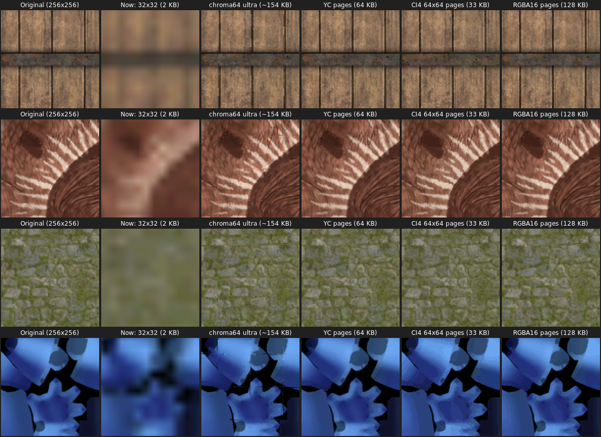
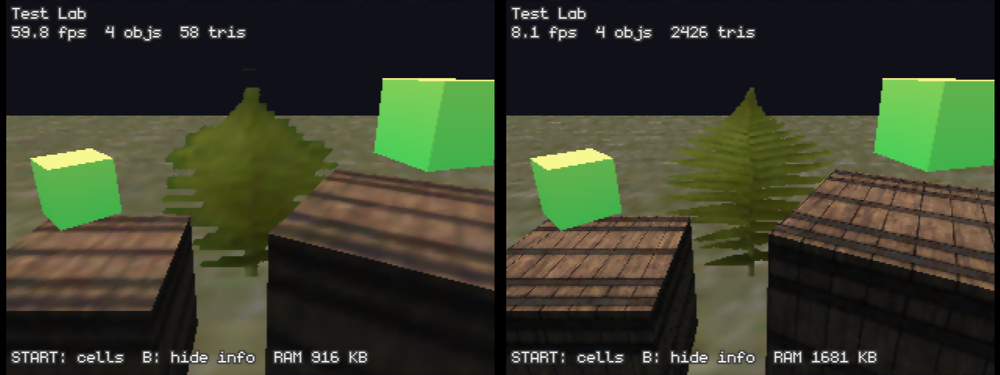
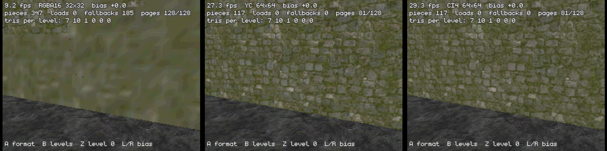

# OpenMW on the Nintendo 64, the whole game on the console

*File: `apps/openmw_n64/PLAN_ALL_ON_N64.md`. Status: current plan. It replaces
the PC-baker design in [ROADMAP.md](ROADMAP.md), which stays as the fallback
(§8 says which parts of it still apply). Numbers marked **measured** come
from builds and emulator runs in this repository. Everything else is an
estimate, and when a measurement disagrees with this file, the measurement
wins.*

---

## 0. The short version

The first roadmap concluded that most of OpenMW would have to run on your PC
(the "baker") and only a small engine could run on the N64. This plan does not
accept that. The goal is:

- **The whole game runs on the N64.** Your own files get converted once, by
  an **online ROM builder**: you give it Morrowind's `Data Files` in the
  browser, and it gives back a ROM plus a data folder for the flashcart's SD
  card (§4.3). After that no PC is involved.
- **OpenMW's real game code runs on the N64.** That means `mwworld`,
  `mwmechanics`, `mwclass`, `mwscript`, `mwdialogue` and `mwstate`, compiled
  nearly unchanged, rather than copied and rewritten.
- **All content:** Morrowind, Tribunal and Bloodmoon.
- **Textures at their original resolution**, using the paging idea from
  CHROMA64. This is already working in the viewer (§1.3). They are stored
  compressed in CHROMA64's C64T format, about 1–1.5 bits per texel with every
  mip level included, and decoded on the console (§1.5).

**How it can work.** The trick is to stop treating the N64 as a machine with
8 MB of memory. With a SummerCart64-class flashcart it has three levels:

| Level | Size | Speed (see §7 for what is unverified) | Role in this plan |
|---|---|---|---|
| RDRAM (Expansion Pak) | 8 MB | fast | the working set: what this frame touches |
| Cartridge SDRAM | 64 MB | a 4 KB page in roughly 0.2–1 ms by PI DMA | code, and the "swap" for the game's memory |
| SD card | gigabytes | slower, and the CPU waits while it reads | the builder's data pack: converted assets, the ESM files, saves |

The N64's CPU has a **TLB**, the hardware that lets a program use more memory
than the machine has. It works by loading pieces ("pages") on demand when the
program touches them; Linux calls this virtual memory. libdragon doesn't use
it, but it does let a program install its own exception handler, which is all
that is needed.

With that in place, the 27.5 MB of OpenMW code and its large memory use
become a question of how much of it is touched *per frame*, not of total
size.

**What doesn't change is the CPU.** The N64's CPU runs at 93.75 MHz, and no
amount of memory fixes that. The target is still about 10–15 fps, with fewer
actors simulated at full rate. This is still a multi-year hobby project. The
difference is that the years go into systems work (paging, backends, speed)
instead of rewriting Morrowind's rules by hand.

---

## 1. What CHROMA64 is, measured

### 1.1 How it works

I read `src/lib/chroma/pipeline.ts` (r19), its tools and its RDP demo.
CHROMA64 builds a texture out of three layers:

- **Colour from vertex colours.** An adaptive quadtree of cells covers the
  image, and each cell is drawn as 4 vertices whose colours carry the
  low-frequency colour (the RDP's SHADE input). Each vertex is 16 bytes.
- **Detail from a small overlay texture.** A greyscale-plus-alpha texture of
  at most 64×64 (I4, IA4 or IA8) carries the luminance detail. A second
  "pigment" colour sits in the ENV register. The colour combiner mixes them:
  `mix(SHADE, ENV, TEXEL0.a) + I`.
- **Unique pages where that fails.** Some 32×32 regions can't be rebuilt that
  way, so they are stored directly as a "unique page": 16×16 flat colour
  cells plus 32×32 I4 luminance.
- **Tiers.** The texture comes in ultra/near/mid/far/sky versions, chosen by
  distance: 3.6, 8, 16, 32 world units, and beyond.

The demo ROMs actually ship reconstructed **RGBA16 32×32 pages**
(`--dump-rgb555`). The church demo keeps 256×256 surfaces in RAM, and uploads
one 32×32 page to TMEM with `rdpq_tex_upload_sub()` whenever the page
changes. To make that work, `tools/gen_rdp_mesh.py` cuts every triangle along
the 32-texel page grid in advance (Sutherland–Hodgman clipping). The church
goes from 325 triangles to 4,828.

### 1.2 Quality against size, on Morrowind-sized textures

I measured 13 CC0 textures from OpenMW's example-suite at 256×256, the size
most of Morrowind's 5,187 DDS files have. The table gives the median PSNR
against the original; higher is better, and above about 35 dB is hard to tell
apart at N64 resolution.

| Method | PSNR | Bytes per texture |
|---|---:|---:|
| The viewer's normal mode: one 32×32 RGBA16 | 25.8 dB | 2 KB |
| One 64×64 CI4 | 28.9 dB | 2 KB |
| Native resolution, CI4 in 64×64 pages | 36.2 dB | 32.5 KB |
| Native resolution, "YC" 64×64 pages, 4× smaller chroma | 36.2 dB | 40 KB |
| Native resolution, "YC" 32×32 pages | 38.7 dB | 64 KB |
| Native resolution, RGBA16 32×32 pages | 40.7 dB | 128 KB |
| CHROMA64 `ultra` tier | 35.5 dB | ~154 KB |
| CHROMA64 `--max` | 38.5 dB | ~228 KB |

"YC" is a split into full-resolution luminance and lower-resolution colour
(explained in §4.4). Here is a 96×96 crop of four of the textures, zoomed 2×:

**Conclusions**

1. **CHROMA64's big win is paging, not its encoder.** Keeping the texture at
   native resolution and streaming TMEM-sized pages is what turns the 32×32
   mush into the original texture.
2. **On 256×256 textures the quadtree barely helps.** 61–64 of every 64 pages
   come out "unique", so CHROMA64 ends up about the same size as plain
   RGBA16, at lower quality. The quadtree pays off on large photos and on
   smooth surfaces (sky, water, distant terrain), where it gets real
   compression.
3. **Splitting luminance from colour inside each page** (the YC pages) gives
   the best quality for the bytes. It is the page format this plan uses.
4. **The quadtree encoder is slow** (2.1–2.6 s per 256×256 texture on a
   PC), so it's used only where it pays off. Building YC or CI4 pages takes
   about 0.1–0.2 s per 256×256 texture in Node, and the code runs in a browser,
   which is where the online builder does it (§4.3).

### 1.3 Proof in the viewer, measured

`make PAGED=1`, or **Z** in the cell list, keeps every texture up to 256×256
at full resolution as 32×32 RGBA16 pages. Meshes are split along the page
grid when they load. Here is the same camera in both modes, in ares:

| | 32×32 textures | Native pages |
|---|---:|---:|
| Frame rate (this view) | 59.8 fps | 8.1 fps |
| Triangles drawn | 58 | 2,426 |
| Texture memory | 2 KB per texture | 320 KB for 3 textures |

The picture is right; the cost is too high. The crate's 24 triangles become
1,032, because each face spans 64 pages. The fix is in §4.4: pick each
object's page size from its size **on screen**, so a distant crate uses one
page and only surfaces right in front of the camera use full-resolution
pages.

### 1.4 The fix, built into CHROMA64 and measured

CHROMA64 now has this as a library (on its `claude/openmw-n64-port-4w9rdc`
branch):

- **`chroma64 pages`** builds the page pyramid in YC, RGBA16 or CI4, with
  cut-out alpha, from PNG, DDS or TGA. The encoder is plain TypeScript and
  runs in a browser.
- **`n64/libchroma`** is the N64 side:
  - a page cache fed by DMA from ROM;
  - TMEM upload, with the YC combiner;
  - a level chosen per triangle from its size on screen;
  - a triangle splitter that runs at load or draw time;
  - a fallback to the coarsest level when a page isn't loaded yet, so it
    never stalls.
- **`n64/pages_demo`** is a room with 512×512 CC0 textures and a cut-out fern.

**Measured in ares** (rdpq directly, not libdragon's GL):

| Case | Frame rate | Pieces per frame |
|---|---:|---:|
| Close to a wall, YC pages, level per triangle | 27 fps | 117 |
| Same view, full resolution forced everywhere | 17 fps | 211 |
| Walking around the room | 19–35 fps | — |

Pieces are the cut-up triangle parts. Compare 8 fps in the viewer's GL
version (§1.3).

*Left to right: RGBA16 32×32 (too many pages this close, so it falls back to
blurry), YC 64×64, CI4 64×64.*

### 1.5 C64T: compressed textures, decoded on the console

Pages fix drawing, but not size: YC pages are 8 bits per texel, CI4 4, plus a
third for the mip levels. CHROMA64's **C64T** format (same branch) is a
modern transform codec built so the N64 can decode it: YCoCg colour, the CDF
9/7 wavelet, a context-adaptive range coder and rate-distortion-optimized
quantization.

- **Size.** About 1–1.5 bits per texel at 36–38 dB PSNR, all mips included.
  On 47 CC0 textures that is 13–20 % smaller than JPEG XL, 17 % smaller than
  WebP and 40–47 % smaller than JPEG at the same PSNR, and level with AVIF
  above 36 dB. None of those can be decoded on an N64.
- **On the N64's screen** (5-bit colour for every format), matching CI4's
  quality takes 18–24 KB for a 256×256 texture where CI4 takes 32.5 KB, or
  43 KB with its mips, which C64T includes. It has no palette banding.
- **Mips are free and streamable.** Each mip level is a prefix of the file:
  a 256×256 texture's 64×64 level is its first 2–6 KB.
- **Decoding**, measured in ares, CPU and RSP together (they give identical
  pixels, checked in `n64/c64t_bench`):

  | Level | Time with the RSP | CPU alone |
  |---|---:|---:|
  | 256×256 | 210–435 ms | 1.0–1.2 s |
  | 128×128 | 67–139 ms | 0.25–0.32 s |
  | 64×64 | 25–54 ms | 66–90 ms |
  | 512×512 | 840 ms | 5.9 s |

  About 95 ms of a 256×256 level is RSP time, during which the RSP draws
  nothing.

**What it changes here.** A rough estimate, assuming Morrowind's 5,187
textures average 256×256: YC pages with mips come to about 430 MB, C64T to
40–60 MB (55–80 MB with the expansions). So the data pack shrinks by 7–10×,
and a whole region's textures fit in cartridge SDRAM compressed. The cost
moves to decoding:

- At a cell change, decode each texture's **64×64 level first** (25–55 ms
  each), then refine the ones near the camera to 128 and 256 in the
  background, a slice per frame.
- The RSP part runs between frames; Tiny3D and the decoder share the RSP
  through rspq, so a slice must fit in the frame's spare RSP time.
- The decoded pixels are RGBA16. Cutting them into 32×32 RGBA16 pages works
  today; making the RSP's last stage write **YC pages directly** (it already
  has the Y, Co and Cg planes) would keep the 64×64 pages that draw fastest.

---

## 2. What runs where

| Piece | Runs on | OpenMW code | Notes |
|---|---|---|---|
| Reading ESM/BSA/NIF | N64 | `components/esm3`, `bsa`, `nif`, unchanged | Already working in the viewer |
| Converting assets: textures to pages, meshes to N64 vertices, audio | **Online ROM builder**, in the browser | `components/nif`, `bsa`, `esm3` built to WebAssembly, + CHROMA64's `pages.ts` | Once per player; writes the ROM + SD data pack (§4.3) |
| Records, world, cells, references | N64 | `mwworld` (ESMStore, CellStore, World), unchanged | Its memory lives in paged memory (§4.1) |
| Game rules: combat, magic, AI, stats, levelling, crime | N64 | `mwmechanics`, `mwclass`, unchanged | Update rates reduced (§4.6) |
| MWScript | N64 | `components/compiler` + `interpreter` + `mwscript`, unchanged | Compiled on the N64, cached on SD |
| Dialogue | N64 | `mwdialogue`, unchanged | |
| Saves | N64 | `mwstate` + `components/esm3` writer, unchanged | Real `.omwsave` files on the SD card. They should open in desktop OpenMW; checking that is part of S7 |
| Renderer | N64 | **new**, replaces `mwrender` + OpenSceneGraph | Tiny3D, texture pages (§4.4) |
| Physics | N64 | `mwphysics` + Bullet **if fast enough**, otherwise a new backend | Bullet is only 0.28 MB of code; the question is CPU time |
| GUI | N64 | `mwgui` + MyGUI, with a **new** rdpq render backend | Reuses all of OpenMW's windows |
| Sound | N64 | `mwsound` + a **new** libdragon mixer output | MP3 voice and music (§4.5) |
| Input | N64 | `mwinput` + a **new** joypad backend | |
| Lua | N64, later (S8) | `mwlua` | 12 MB of code. See §3 |

On a PC you only run the builder web page once and copy its output to the SD
card.

---

## 3. The code, measured

All of `apps/openmw` and `components`, plus OpenSceneGraph, MyGUI, Bullet,
Recast, FreeType, SQLite, Lua 5.1, yaml-cpp, Boost.ProgramOptions, zlib and
LZ4, were cross-compiled for the N64's CPU with the libdragon toolchain. That
is GCC 16.2, C++20, `-Os`, one section per function. Then everything was
linked the way a real build would link it, with unused code removed
(`--gc-sections`).

- **Compile result:** 823 of 826 OpenMW game files compile. The 3 that don't
  are the FFmpeg video player, which isn't needed.
- **Portability fix needed:** on this toolchain `int32_t` is `long`, not
  `int`. That broke 58 files (`std::max(int32_t, int)` and similar). Every one
  compiles with the type override flags `-D__INT32_TYPE__=int` and the
  matching unsigned version.
- **Not included:** ICU was not built. `components/l10n` needs
  `icu::MessageFormat`, and ICU is about 444 files, so it will add to these
  numbers.

**Linked size, measured** (code + read-only data + exception tables; ROM
bytes):

| Part | MB |
|---|---:|
| Game rules: `mwworld`, `mwclass`, `mwmechanics`, `mwscript`, `mwdialogue`, `mwstate` | 2.5 |
| Data and script components: `esm`, `esm3`, `bsa`, `nif`, `compiler`, `interpreter`, `files`, `settings`, … | 1.3 |
| Renderer: `mwrender`, `sceneutil`, `nifosg`, `resource`, `shader`, `fx`, `terrain` + OpenSceneGraph | 3.6 |
| GUI: `mwgui`, `widgets`, `myguiplatform` + MyGUI + FreeType | 2.8 |
| Lua: `mwlua`, `components/lua`, `lua_ui` + Lua 5.1 | 12.0 |
| Physics and navigation: `mwphysics`, `detournavigator` + Bullet + Recast | 0.7 |
| Sound and input | 0.2 |
| Runtime: libstdc++, newlib, libgcc, libdragon | 1.3 |
| Merged strings and constants, and the rest (SQLite, yaml-cpp, Boost, ESM4, …) | 3.1 |
| **Total** | **27.5** |
| **Without Lua** | **15.5** |

What this means:

- **Total size is not the problem.** Even 27.5 MB fits in a 64 MB cartridge.
  Only the pages a frame actually runs need to be in RDRAM (§4.1).
- **The renderer (3.6 MB) gets replaced**, and some GUI and resource code
  goes with it. Without Lua and the renderer, what stays is about 11–12 MB.
- **Lua is the outlier.** 9.5 MB of it is machine code, almost all of it
  generated by the sol3 binding templates, not the Lua interpreter. Recent
  OpenMW versions put some basic behaviour in built-in Lua scripts (player
  controls, camera, some UI). This plan first replaces the scripts it needs
  with small C++ versions (S3), and tries the real `mwlua` later (S8). Paged
  from the cartridge, its size isn't fatal; its RAM and CPU cost might be.

---

## 4. The key pieces

### 4.1 Virtual memory on the N64

**Code paging (read-only; works with any cartridge).**

1. **Linking.** The program is linked to run at mapped virtual addresses, and
   stored in the ROM image as-is.
2. **Resident code.** A small resident core never pages: the exception
   handler, libdragon, the audio thread, and the DMA code. It lives in
   ordinary unmapped memory (KSEG0). Calls between the resident core and
   paged code go through `-mlong-calls` or small stubs.
3. **Page faults.** When the CPU runs code that isn't loaded, the TLB raises a
   miss. The handler then:
   - picks a free 4 KB or 16 KB frame (clock replacement);
   - DMAs the page in from the cartridge;
   - invalidates the instruction cache for that frame;
   - writes the TLB entry;
   - returns.
4. **Page size.** The VR4300 has only 32 TLB entries, each mapping an
   even/odd pair of pages. With 4 KB pages that covers only 256 KB, so a
   program this size needs a **fast refill handler** on the TLB-refill vector
   for pages that are already in RAM (tens of cycles), separate from the slow
   "load from cartridge" path. 16 KB pages raise the reach to 1 MB at the cost
   of longer loads. S1 measures both.
5. **Layout.** Functions that run every frame are laid out next to each other
   (GCC's `-freorder-functions` plus a linker order file from a profile), so
   the per-frame code fits in a few hundred KB of frames.

**Data paging (needs a writable cartridge).**

- **Why it's needed.** OpenMW keeps every record of every loaded content file
  in memory (`ESMStore`). The old roadmap estimated 11 MB for Balmora,
  records included, and that is before Tribunal and Bloodmoon.
- **How.** The same mechanism works for the heap, if the cartridge's 64 MB
  SDRAM can be written from the N64. SummerCart64 has a ROM write-enable
  setting for this, and 64drive has a similar mode (verify both in S0).
  Dirty pages are written back by PI DMA before their frame is reused.
- **What it relies on.** Most of the records are cold at any moment: dialogue
  for NPCs you are not talking to, spells nobody is casting, cells you are
  not in. That is exactly what paging handles well. If the *hot* set doesn't
  fit, it thrashes; kill criterion K2 in §6 catches that early.
- **Allocator.** A cold/hot split helps a lot: long-lived stores
  (`ESMStore`) come from their own arena, which pages. Per-frame data comes
  from an arena pinned in RAM.

**RAM plan (8,192 KB).**

| Use | KB |
|---|---:|
| Frame buffers (3 × 320×240×16) + Z-buffer | 600 |
| libdragon, rspq/rdpq, Tiny3D, stacks, audio buffers | 400 |
| Resident code: handlers, runtime, hot per-frame functions | 900 |
| Code page frames | 1,200 |
| Data page frames: the OpenMW heap working set | 2,600 |
| Pinned per-frame arena | 400 |
| Texture page cache (≈ 1,000 × 2 KB, or 500 × 4 KB) | 1,000 |
| Mesh cache: player cell + neighbours, in N64 vertex format | 800 |
| Slack | 292 |

### 4.2 Storage: SD card to cartridge SDRAM to RDRAM

- **SD card: the builder's data pack** (`sd:/omw64/`). It holds every
  texture (as C64T, §1.5), mesh and sound, the ESM files (OpenMW's own record
  loading reads them unchanged), and the saves. The BSAs aren't needed on
  the console any more. There is no 64 MB cap, which is what makes Tribunal
  and Bloodmoon possible.
- **Cartridge SDRAM: a 64 MB cache.**
  - What goes in: the program image (15–28 MB, see §3), the paged heap, and
    the assets of the current region.
  - When it's filled: at load screens and cell changes, from the SD card.
  - Why: SD reads through libcart keep the CPU busy the whole time, so they
    must never happen in the middle of a frame.
- **RDRAM: the pages this frame touches**, decoded from C64T when a region
  loads and refined in the background (§1.5).
- **Tribunal and Bloodmoon** only add to the data pack and to `ESMStore`.
  Their records page like the rest.

### 4.3 The online ROM builder

The player opens a web page, points it at their `Data Files` folder, and
downloads two things:

- **The ROM:** OpenMW for the N64, the same for everyone, plus a small
  index.
- **A data pack for the SD card:** everything converted from their files.

**Where the conversion runs.** It should run **in the browser**, so the game
files never leave the player's computer:

- CHROMA64's C64T and page encoders and its DDS/TGA readers (`c64t.ts`,
  `pages.ts`, `dds.ts`, `split.ts`) already run in a browser.
- OpenMW's readers (`components/esm3`, `bsa`, `nif`) are plain C++ and can
  be built to WebAssembly with Emscripten.

**The steps.** Running on a PC, the builder can do the work that was too
slow for the console:

| Step | What | Estimate (browser) |
|---|---|---|
| Textures | 5,187 DDS in Morrowind.bsa, plus the expansions'. C64T for all of them (§1.5); CHROMA64's quadtree remains an option for sky, water and distant terrain | about 0.06 s each for 256² at a fixed quantizer step, 0.6 s when searching for a target PSNR (Node, one core); web workers divide that by the core count |
| Meshes | 5,798 NIFs in Morrowind.bsa, plus the expansions'. Parse with `components/nif`, flatten, write N64 vertex data, and pre-split each mesh for each mip level | minutes |
| Audio | Transcode the MP3 voice and music to a format libdragon plays cheaply: VADPCM, or Opus in wav64, which is RSP-assisted | minutes; MP3 decoding in the browser is fast |
| ESM files | Copied as they are; the N64 runs OpenMW's own loader on them | — |
| Check | Hash the ESMs against known versions; warn about unknown ones | — |

**This is not the old PC baker.** That design converted the *game logic* into
compact tables and rewrote Morrowind's rules for a small engine. The builder
converts only *assets*; the rules on the console are still OpenMW's own code.
If kill criterion K1 fires (no writable cartridge memory), the builder is
also where the old roadmap's compact record tables would be made.

**Legal note.** No one distributes anything made from Morrowind:

- the builder page and the ROM contain only OpenMW (GPL) and CHROMA64 (MIT)
  code;
- each player converts their own copy.

If the conversion ever runs on a server instead of in the browser, the server
must delete uploads after the build and serve the output only to the person
who uploaded it. Running it client-side avoids the question.

### 4.4 Renderer: Tiny3D with screen-sized texture pages

- **Engine: Tiny3D, not libdragon's OpenGL.** It is much faster, and this
  repository has already hit two GL problems: display lists crash, and fog
  corrupts texture coordinates (see the README).
- **Page format: YC 64×64.**
  - A page holds 64×64 I4 luminance (2 KB) plus 32×32 RGBA16 colour (2 KB),
    which is exactly TMEM's 4 KB.
  - The RDP combines the two in 2-cycle mode:
    `(TEX0 − ENV) × PRIM + TEX1`. ENV holds I4's mid-grey, PRIM holds the
    page's luminance amplitude, and TILE1 reads the colour at half
    resolution.
  - Plain RGBA16 32×32 pages are the fallback. CI4 64×64 pages suit
    low-colour textures.
- **Mip pyramid of pages.** Each texture is stored as a pyramid of pages. A
  256×256 texture has 16 pages at level 0, 4 at level 1, and 1 at level 2 and
  below.
- **Screen-sized page selection.** For each object and frame, pick the mip
  level where one texel covers about one pixel, from the object's projected
  size and its texture density. Geometry is split for that level (splits are
  cached per level).
  - What this buys: a distant crate draws its original triangles with one
    page; a wall you stand next to draws its full-resolution split.
  - Why it's bounded: the extra triangles and TMEM loads depend on **screen
    area**, not scene complexity. About 20 pages of 64×64 cover a 320×240
    screen at 1:1, so there are never more than a few dozen full-resolution
    pieces per frame.
- **Page cache.** About 1 MB of RDRAM, least-recently-used, refilled from
  cartridge SDRAM by PI DMA. A missing page draws its coarsest level for a
  frame; it never stalls. This is `n64/libchroma` (§1.4); it needs porting
  from rdpq triangles to Tiny3D's pipeline.
- **Terrain, sky and water.** These are CHROMA64's real strength: smooth,
  large surfaces where its quadtree compresses well. The builder runs the
  full encoder for them.
- **Known gaps from the demo.** Pages clamp at their borders, and cuts in
  neighbouring triangles don't always meet, so faint seams can show close
  up. A 1-texel page border and shared cut vertices fix them.

### 4.5 Sound

- **Voice and music are MP3** (6,448 voice files, 128 MB; 18 music tracks,
  39 MB).
- **The builder transcodes them** to a codec libdragon plays cheaply:
  VADPCM, or Opus in wav64, which is RSP-assisted. The N64 never decodes MP3.
- **Which codec:** S5 compares their size on SD against their CPU and RSP
  cost. Sound effects are WAV and are converted the same way.

### 4.6 The CPU wall

A 93.75 MHz CPU can't run OpenMW's full per-frame work for a town at 30 fps.
The levers, all of which keep OpenMW's rules intact:

- **Fewer actors simulated at full rate.** The nearest 8 get full AI and
  animation. Everyone else updates at 1–5 Hz, or goes dormant with catch-up
  on wake. This needs a scheduler hook in `mwmechanics/actors.cpp`, a small
  patch.
- **Cheaper physics.** Bullet sweeps only for moving actors, with simple
  shapes. If S4 shows Bullet is too slow, write a native `mwphysics` backend
  using the same movement rules.
- **Lower update rates for the rest.** Scripts, sound and GUI run at the
  frame rate; the world clock and weather run at a fixed low rate.
- **Targets:** 15 fps in interiors, 10–12 fps in towns, and 320×240.

---

## 5. OpenMW code changes

The goal is still to change OpenMW as little as possible:

- **Byte-order fixes**, already done (see the README).
- **`int32_t` fixes.** These are small type fixes that would be worth
  sending upstream. The alternative is the compiler flag override.
- **An `OPENMW_N64` build of `apps/openmw`.** It swaps `mwrender`,
  `mwphysics` (if needed), the sound output, input and the MyGUI render
  platform for N64 backends. Wherever possible this goes through the
  interfaces OpenMW already has:
  - `MWRender::RenderingManager` is used through a small set of calls from
    `mwworld`, so a replacement implements those.
  - `Sound_Output` is already an interface.
  - MyGUI's `RenderManager` is already an interface.
- **Actor update scheduling** (§4.6) is a small patch in
  `mwmechanics/actors.cpp`.
- **No threads.** libdragon's C++ runtime has no `std::thread`. The
  single-threaded `compat/mutex` shims already used by the viewer extend to
  OpenMW's worker queues, which then run inline or in time slices.

---

## 6. Milestones

Each milestone ends with a test that runs on real hardware.

| # | Milestone | Exit test | Kill criterion, and the fallback |
|---|---|---|---|
| **S0** | **Hardware truth** | Measure on SummerCart64: PI DMA speed from cartridge SDRAM, writing SDRAM from the N64, SD read speed, and a TLB-miss round trip. Build an emulator harness: patch ares for writable cartridge space and SD, or find an emulator that already does both | **K1:** cartridge SDRAM can't be written from the N64 → no data paging → records go through the old roadmap's compact tables (ROADMAP.md §2) |
| **S1** | **Paged code** | The current viewer runs with its code in mapped, paged memory. Count faults per frame | **K2:** the hot set doesn't fit (more than about 10 faults per frame in steady state, after reordering) → cut code (drop Lua, use `-fno-exceptions` where possible) or go back to the baker |
| **S2** | **Online builder v0** | A web page, entirely in the browser: pick a `Data Files` folder, get a ROM + SD pack. First with the example-suite, then real Morrowind. OpenMW's readers built to WebAssembly | **K3:** a full Morrowind build takes more than 30 minutes → cache per file, and convert in web workers |
| **S3** | **OpenMW headless on the N64** | `apps/openmw` with a null renderer loads Morrowind.esm, starts a new game, runs scripts and dialogue in Seyda Neen. Measure page faults and CPU per frame | **K4:** the world update in Balmora takes more than 70 ms per frame after the §4.6 levers → the baker plan's copied rules win |
| **S4** | **Renderer** | Tiny3D with screen-sized YC page streaming, pages decoded from C64T at load and refined in the background. Seyda Neen and Balmora at 12+ fps, with no page-streaming stalls | Pages never stall a frame (the parent mip level stands in); decoding too slow → ship the region's first mip levels pre-decoded |
| **S5** | **Sound, input, GUI** | MyGUI on rdpq; the menus, inventory, dialogue and journal work with a controller; voice plays | |
| **S6** | **Physics and actors** | Walk, jump, swim, fight; 8 full-rate actors, the rest scheduled | Bullet too slow → native backend |
| **S7** | **Saves and the vertical slice** | Chargen → Seyda Neen → Balmora → Caius → save and load on hardware. The `.omwsave` opens in desktop OpenMW | |
| **S8** | **Everything** | All of Vvardenfell, Tribunal, Bloodmoon; try the real `mwlua` | Lua too big or slow → keep the C++ replacements |

**The next three tasks**

1. **S0 on hardware.** A SummerCart64 test ROM that measures DMA speed,
   writes SDRAM, and reads the SD card. It also installs a TLB-miss handler
   that maps a page from the cartridge and runs code in it.
2. **A working-set measurement on the PC.** Run a 32-bit desktop OpenMW in
   Balmora with a page-touch tracer (for example `mprotect` / `userfaultfd`,
   or Valgrind's lackey). Count how many distinct 4 KB code and heap pages
   each frame touches. This decides K2 and data paging before any N64 work.
3. **S1 with the viewer.** Link the viewer at a mapped address and page it.
   It is small, but it exercises the whole fault path.

---

## 7. What is not verified yet

The research that was meant to check these ran out of time. Each is an S0
task:

- Whether SummerCart64, EverDrive-64 X7 and 64drive let the N64 write
  cartridge SDRAM while a game runs, and how fast.
- Real PI DMA speed from flashcart SDRAM, and SD read speed through libcart
  on each cart.
- Which emulator, if any, emulates writable cartridge space and SD.
  **Measured:** ares (the version built by Pak's `tools/build_ares.sh`) has
  neither, so the harness means patching it.
- Whether libdragon's exception entry can be bypassed for a fast TLB-refill
  handler.
  **Measured:** libdragon handles TLB exceptions only as crashes, but
  `register_exception_handler()` lets a program take them over.
- The CPU and RSP cost of playing VADPCM or Opus voice and music alongside
  everything else.
- That OpenMW's `components/esm3`, `bsa` and `nif` build with Emscripten
  without changes (they are plain C++, and already build for MIPS).
- C64T decode times on real hardware (measured in ares only), and how much
  RSP time Tiny3D leaves for decoding in the background.

---

## 8. What still applies from ROADMAP.md

- **Unchanged:** the acceptance test (a full playthrough with saves), the
  controller UI adaptations, the 320×240 display and the actor limits.
- **Moved:** the frame budget method moves to S3/S4, measured instead of
  estimated.
- **Unchanged:** Pak's tooling (the ares build, the headless test harness,
  and its N64 hardware notes).
- **Kept as a fallback:** the PC baker is where kill criteria K1, K2 and K4
  lead. Its compact records and copied rules are what gets built if OpenMW's
  own code can't fit or can't keep up.
