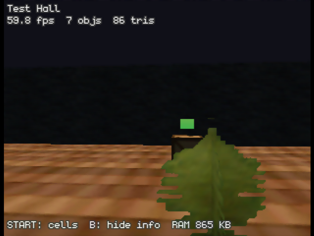
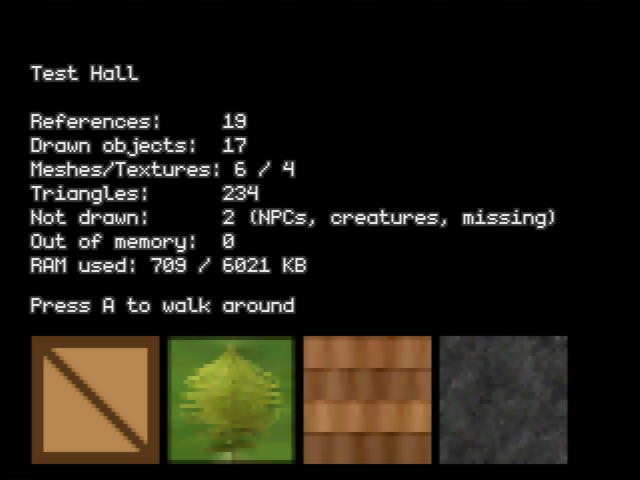
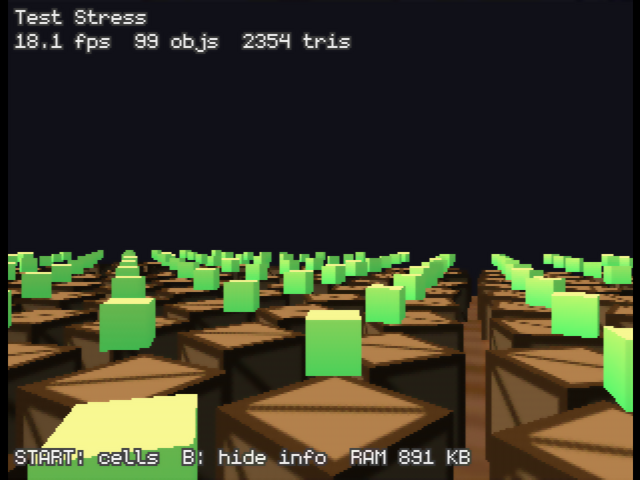

# OpenMW-N64

Walk around Morrowind's interior cells on a Nintendo 64.

This is **not** the full OpenMW game running on an N64 — that is not possible
(see [Why not the whole game?](#why-not-the-whole-game)). It is a cell viewer
that runs **OpenMW's own file-format code**, cross-compiled from C++ to the
N64's MIPS VR4300 CPU, and draws what it loads with the N64's RSP/RDP through
libdragon:

- `components/esm3` reads `Morrowind.esm` (cells, references, object records)
- `components/bsa` reads `Morrowind.bsa` / `Tribunal.bsa` / `Bloodmoon.bsa`
- `components/nif` parses the `.nif` meshes

Everything under `components/` is compiled straight from this tree. The N64
front end (this directory) is about 2,600 lines of C++.

| Test cell (loads, textures, alpha, NIF node transforms) | Load summary, with the textures as uploaded |
|---|---|
|  |  |

Screenshots are from the [ares](https://ares-emu.net) emulator (accurate
RSP/RDP), using the synthetic test data described below — not Morrowind.

## Trying it

`dist/openmw_n64_testdata.z64` is a ready-built ROM with a small test data set
inside it, so it runs in an emulator or on a flashcart without any game files.
Use an accurate emulator (ares, or a flashcart on real hardware); HLE
emulators such as Project64 or Mupen64Plus-FZ will show a black screen,
because libdragon's microcode needs low-level RSP emulation.

### With real Morrowind data (flashcart only)

1. You need an **Expansion Pak** (8 MB RAM) and a flashcart with an SD card
   that libdragon supports (SummerCart64, EverDrive-64 X7/V3, 64drive).
2. Copy the contents of Morrowind's `Data Files` folder to the SD card as
   `Data Files/` (so `sd:/Data Files/Morrowind.esm` exists), with the `.bsa`
   archives next to it.
3. Boot the ROM. It indexes `Morrowind.esm` once at startup (it reads the
   whole 79 MB file from the SD card, so give it a while), then lists every
   interior cell.

This path has **not been tested on real hardware or with real Morrowind data
yet** — only in ares with the synthetic data. Expect bugs; the load summary
screen and the USB/emulator log (`Loaded ...`, `Mesh not found ...`) are there
to help find them.

### Controls

| Menu | |
|---|---|
| D-pad up/down | choose a cell |
| D-pad left/right, C-up/down | page up/down |
| Z | textures: 32×32, or native-resolution pages |
| A or START | load the cell |

| Walking | |
|---|---|
| Analog stick | walk forward/back, turn |
| C-left / C-right | strafe |
| C-up / C-down | look up/down |
| R / Z | fly up / down |
| L (hold) | move faster |
| B | hide the info overlay |
| START | back to the cell list |

## What works and what doesn't

Works:

- Interior cells: statics, doors, containers, lights, items, activators —
  any object with a single static mesh
- NIF scene graphs: node transforms, `NiTriShape`/`NiTriStrips`, switch/LOD
  nodes, hidden and collision nodes skipped
- Textures: DDS (DXT1/3/5, uncompressed) and TGA, from BSAs or loose files
  (loose files win, like in the game), shrunk to fit the N64's 4 KB texture
  memory (at most 32×32 texels, RGBA 5551) — or, with **Z** in the cell
  list, kept at native resolution as 32×32 pages (see below)
- Vertex colors, material color/emission, alpha testing, two-sided materials
- Cell ambient and "sunlight" colors (the `AMBI` record) as the lighting

Not (yet):

- Exterior cells and terrain (`LAND`), water, sky
- NPCs and creatures (skinned, animated meshes) — counted as "not drawn"
- Point lights from `LIGH` references, particles, animation
- Tribunal/Bloodmoon/plugins: only one content file is loaded
  (`Morrowind.esm`, or the first `.esm` found); their BSAs are used
- Gameplay of any kind: scripts, dialogue, physics, UI, sound

Performance: the 20×20-crate stress cell (401 objects, ~2,400 triangles on
screen) runs at about 10 fps in ares, or about 18 fps in a
`make DISPLAY_LISTS=1` build (see the gotchas below for why that is not the
default). Real Morrowind interiors have several times that many triangles, so
expect single-digit frame rates in big rooms until there is some
level-of-detail work.



### Native-resolution texture pages (CHROMA64-style)

The N64 can only texture from its 4 KB TMEM, which is why textures are
normally shrunk to 32×32. [CHROMA64](https://github.com/atyr647/chroma64) gets
around that by cutting a big texture into TMEM-sized **pages** and cutting
each triangle along the page borders, so every piece only needs one page.
Pressing **Z** in the cell list turns the same idea on here: every texture up
to 256×256 is kept at full resolution as 32×32 RGBA16 pages, and meshes are
split along the page grid when they load.


*Left: the normal 32×32 textures, 60 fps. Right: native-resolution pages,
same camera, 8 fps.* It looks like the original textures, but it is slow: the
crate's 24 triangles become 1,032 when cut along the page grid, and paged
parts can't use display lists. It is a proof of concept for the texture plan
in [PLAN_ALL_ON_N64.md](PLAN_ALL_ON_N64.md), which bounds that cost by
choosing each object's page resolution from its size on screen.

## Why not the whole game?

The C++ does compile to MIPS — that part is fine; this port proves it. The
wall is the hardware:

| | OpenMW on a PC | Nintendo 64 |
|---|---|---|
| RAM | 1–4 GB used | 4 MB (8 MB with Expansion Pak) |
| CPU | multi-GHz, many cores | 93.75 MHz, one core |
| GPU | OpenGL 3+ with shaders | fixed-function RDP, 4 KB texture memory |
| Game data | ~1 GB of ESM/BSA files | 64 MB max cartridge; SD card via flashcart |

OpenMW itself also depends on OpenSceneGraph, Bullet physics, SDL2, OpenAL,
FFmpeg, MyGUI, LuaJIT, Boost, ICU, SQLite and more — none of which exist for
the N64. So this port keeps OpenMW's data *readers* (which are plain C++) and
replaces everything above them with a small N64 renderer.

## How it is put together

| File | What it does |
|---|---|
| `main.cpp` | boot, cell list, load summary, free-fly camera |
| `datafiles.*` | finds `Data Files` on SD (`sd:/`) or in the ROM (`rom:/`); loose files, then BSAs via `Bsa::BSAFile` |
| `worldindex.*` | one pass over the ESM: interior `ESM::Cell`s (with their file positions) and a compact object-id → model table |
| `scene.*` | reads a cell's references with `ESM::Cell::getNextRef`, places meshes, draws with libdragon's OpenGL |
| `meshloader.*` | `Nif::Reader` → flattened vertex/index data → GL display lists |
| `texture.*` | DDS/TGA decoding, mip-level selection, TMEM-sized RGBA16 surfaces |
| `compat/` | single-threaded `std::mutex`/`std::condition_variable` (libdragon's libstdc++ has no threads), and the two small generated OpenSceneGraph config headers |
| `tools/make_test_data.py` | writes the synthetic test data |

Changes to OpenMW's shared code, all no-ops on the PC build:

- `components/esm3/esmreader.hpp`, `components/esm/esmcommon.hpp`,
  `components/bsa/bsafile.cpp`: byte-swap on big-endian CPUs (the N64 is
  big-endian, Morrowind's files are little-endian). `components/nif` already
  handled this.
- `components/bsa/bsafile.cpp`: a `std::max` that did not compile where
  `size_t` is 32 bits.
- `components/nif/node.cpp`: skip building Bullet collision shapes when
  `OPENMW_N64` is defined.

### N64-specific gotchas this ran into

Useful if you build anything else with libdragon's OpenGL (preview branch):

- **Positions must stay within ±1024 units** in model *and* eye space: the RSP
  converts them to 16-bit fixed point with 5 fractional bits. Morrowind units
  are small (a room is ~2000 units), so the renderer works in quarter-size
  "render units" and scales large meshes further by a power of two. Putting
  that scale in the modelview matrix instead dims lighting, because normals
  get scaled too.
- **Fog's end distance** goes through the same 16-bit conversion.
- **Enabling `GL_FOG` corrupts texture coordinates** on the RSP pipeline in
  the libdragon revision used here: textures collapse to their first few
  texels. libdragon's own `gldemo` cube shows the same. Fog is left off.
- `glTexParameteri(..., GL_TEXTURE_WRAP_*)` must come before
  `glSurfaceTexImageN64`, or libdragon asserts.
- libdragon defines `N64` as a macro, so don't name a namespace `N64`.
- Recording each mesh into a display list roughly doubles the frame rate
  versus drawing from vertex arrays, since the CPU no longer re-converts
  every vertex every frame. **But** replaying display lists crashes the RSP
  now and then: an RSP/RDP hang ("wait loop timed out" in `rspq_next_buffer`)
  or a `break` in the generated vertex loader. It comes and goes with
  unrelated changes to the program and camera angle, and it always happens
  with many small lists and a texture switch between each one. Vertex arrays
  never crashed in any of the same tests, so they are the default here;
  `make DISPLAY_LISTS=1` turns the lists back on.
- The fps counter must average frame *times*: averaging `1/dt` read
  1,694 fps once, because with triple buffering some frames return from
  `display_get()` almost at once.

## Building

Needs the libdragon toolchain and the libdragon **preview** branch (for its
OpenGL), plus the OpenSceneGraph 3.6.5 *source* (only its math headers and two
`.cpp` files are used).

```bash
# Toolchain (prebuilt, Linux x86-64; or see libdragon's build-toolchain.sh)
curl -LO https://github.com/DragonMinded/libdragon/releases/download/toolchain-continuous-prerelease/gcc-toolchain-mips64-x86_64.deb
sudo dpkg -i gcc-toolchain-mips64-x86_64.deb          # installs to /opt/libdragon
export N64_INST=/opt/libdragon PATH=/opt/libdragon/bin:$PATH

# libdragon, preview branch
git clone -b preview https://github.com/DragonMinded/libdragon
make -C libdragon -j4 libdragon install tools tools-install

# OpenSceneGraph source
git clone --depth 1 -b OpenSceneGraph-3.6.5 https://github.com/openscenegraph/OpenSceneGraph.git osg

# The ROM
cd apps/openmw_n64
python3 tools/make_test_data.py          # optional: test data into filesystem/ -> rom:/
make OSG_SRC=/path/to/osg -j4            # -> openmw_n64.z64
```

`tools/make_test_data.py --example-suite DIR` also pulls CC0 textures (a
DXT5 fern with alpha, and — resized to 256×256 with ImageMagick, if
installed — rock, road and barrel textures) from a git-lfs checkout of
[OpenMW's example-suite](https://gitlab.com/OpenMW/example-suite).

For emulator testing, `make AUTOPLAY=1 AUTOPLAY_CELL="Test Hall"` builds a ROM
that enters that cell and turns the camera by itself. Add
`AUTOPLAY_YAW=0.0 AUTOPLAY_PITCH=-0.35` for a fixed camera (for comparing
screenshots), and `PAGED=1` to start with native-resolution textures. The screenshots here were
taken that way in headless ares, built with the Pak repository's
`tools/build_ares.sh`.

## Where this could go next

[PLAN_ALL_ON_N64.md](PLAN_ALL_ON_N64.md) is the current plan: the whole game
on the console, with assets converted once by an online ROM builder from the
player's own files. It replaces the PC-baker design in
[ROADMAP.md](ROADMAP.md). Smaller next steps for the viewer:

- Exterior cells: `LAND` heightmaps are regular 65×65 grids, a good fit for
  the N64 once reduced
- Point lights from `LIGH` references (libdragon GL has 8 lights)
- Level of detail: drop small objects at distance and cap triangles per frame
- Choose each object's texture page size from its size on screen, and use
  64×64 pages, to cut the triangle cost of paging
